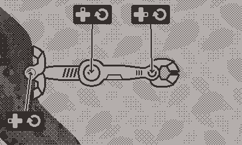
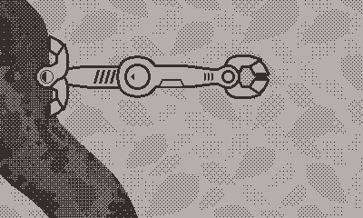
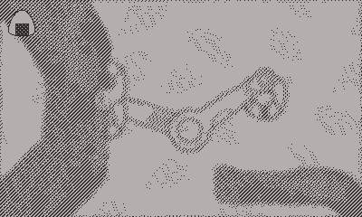

# Magero

A platform game for the Playdate console, featuring a robot with smooth crank-based controls and a sizable world for exploration.

Download here: https://uguu-org.itch.io/magero

*Reading the source code will expose you to spoilers!*  Please try to complete the game first before reading further.  This page is spoiler-free user documentation, spoiler-prone developer documentation can be found in [dev_readme.md](dev_readme.md).

## Controls

To rotate a single joint, hold Left or Up or Right on the D-pad, then turn the crank.  Holding a diagonal Left+Up or Right+Up and turning the crank will cause two joints to be rotated simultaneously.

When an action is available near the hand, a blinking cursor will appear.  Press Down to execute the action.

Pressing A or B will show the list of items that have been collected.

## Options menu

   * reset: reset all progress and restart from scratch.  Progress is automatically saved on exit, so you will always resume at where you left off last time unless you do a reset.
      * hints: set verbosity level for help/spoiler display.
      * none: don't show any hints.
      * basic: show basic controls after a few seconds of idleness.
      * more: show a triangle pointing at the nearest off-screen item.
      * even more: show a triangle pointing at the nearest item, even if it's on screen.
      * extra: flash walkable/breakable/actionable tiles after few seconds of idleness.
   * flex: set direction of joint rotation in response to crank movement.  If hint verbosity is set to "basic" or above, the popup displays will show the rotation direction for each joint.

## FAQ

Q: There is this surface that I can't walk on?
A: Try taking a step back or a small step forward to reposition the base of the arm.  It might also be that the surface is not meant to be walked on, such as a breakable surface.

Q: I can't pickup this item?
A: Try approaching the item from a different angle.

Q: I threw this thing and now it's gone, or it's stuck somewhere.
A: Go back to where you first found it to summon it back into place.

Q: I am playing this in the simulator and the game becomes laggy after a while.
A: Try playing with Malloc Pool disabled, or manually clear malloc history periodically.
