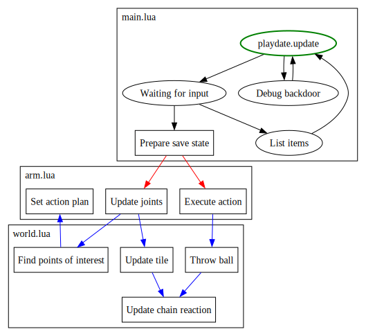
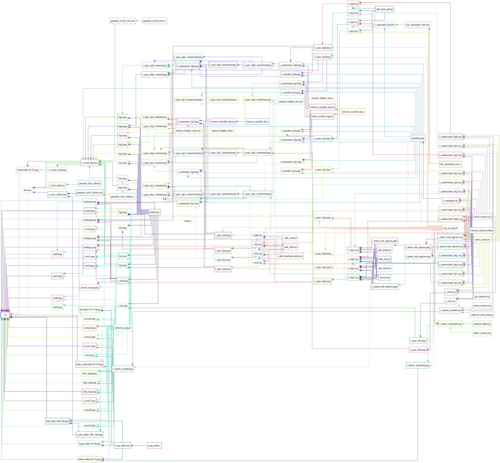
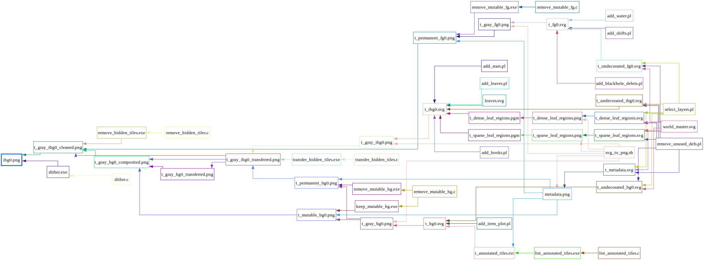
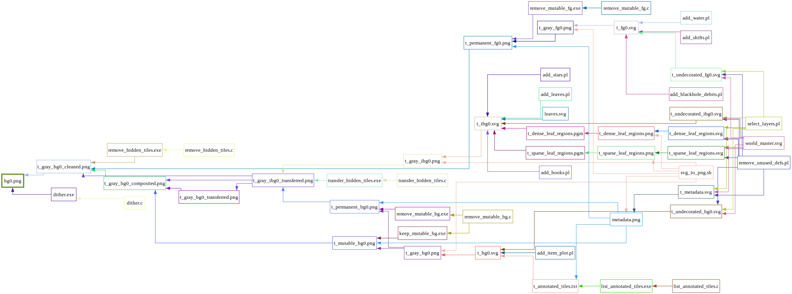
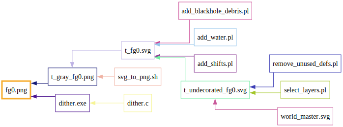

# Developer documentation for Magero

Reading the source code will expose you to spoilers!  If you haven't completed the game yet, you should start with the [user documentation](README.md).

## Code organization

`source` directory contains all the files needed to build the final zip package.  Look here if you are interested in tweaking game logic.

`data` contains all the files and tools needed to build `source/data.lua` and all the images in the subdirectories.  Look here if you are interested in updating game graphics and map layout.

Build environment and toolchain requirements can be found in `Makefile` comments.

## Game logic

Game control flow is roughly summarized in the following state diagram:



This diagram hides a lot of implementation details, but the high level takeaway is that this game has very few modes of operation, and all events are triggered on user input.  If the user remains idle, the world all relevant game states will remain constant.  This means there is very little timing or reflex elements in this game, player can go at their own pace, and stop anytime.  The intent is to make a game where player can casually enjoy the smooth interactions with the crank.

## Game assets

All game assets are generated from a mixture of SVG and Perl.  Build graph for the full asset pipeline is below:



The core of the game is the 300x200 world, which consists of three graphical layers with 4 animation frames each, plus a metadata layer.  Build graphs for a single frame of each layer are generated below for readability.

Immutable background layer:



Background layer:



Foreground layer:



These diagrams are generated using `data/generate_build_graph.pl`.  To debug build steps for a single target, try:

```
perl data/generate_build_graph.pl data/Makefile {target} > a.dot && dot -Tsvg -o a.svg a.dot
```

Note that everything is generated from a single `world_master.svg` file.  Rather than building a full level editor from scratch, we have adapted [Inkscape](https://inkscape.org/) for editing both graphics and metadata, and added tooling around the SVG output to produce PNG and Lua files that can be used by Playdate.  For the bits that would have been tedious to draw and animate by hand (such as tree leaves in the background), a set of Perl scripts were used to modify the intermediate SVGs before they are rasterized.

## Customizing this game

Graphical changes can be achieved by editing `data/world_master.svg`, be sure to follow the layer naming conventions in that file.  Those changes can be applied by running `make refresh_data` followed by `make` or `make release`.  Note that you will need at least Inkscape 1.4 or newer, see `data/svg_to_png.sh` for more details.

For small changes that updates graphics for a few tiles, `data/preview.sh` may help you iterate quickly.

For large changes that affect many tiles, note that Playdate has a memory limit that needs to be taken into consideration.  `make -C data debug_rare_tiles` will tell you how many tiles you are using.

As long as you don't touch the metadata layers, all graphical changes will be backward compatible.  If you do touch the metadata layers (collision or annotations), there is some risk that existing save states will be be invalid.  The game will try to detect incompatible states on load and reset automatically, but it's not foolproof, and you may need to do a manual reset.

For general level design, the process that I used was as follows:

1. Draw a sketch that gives a general outline as to what the area will contain.  Some of these sketches are available inside `world_master.svg` under "sketch" layer.

2. Draw collision layer and test that all spots that are meant to be reachable are actually reachable.  Surfaces with many steps (such as tree trunks) tend to be most problematic.

3. Draw grayscale graphics, remember to periodically test with `preview.sh` to verify how they will look when dithered.  For surfaces that are meant to be mountable, prefer colors that are either very dark or very bright, since colors that are close to 50% gray will make the cursor difficult to see.

4. Test the final result.
